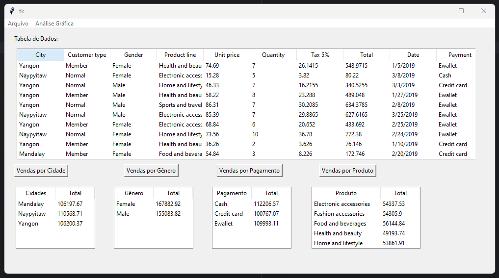

# Interface Gráfica para Data Analysis



<h1 align="left">Olá , Este é meu projeto de Data Visualization</h1>

Para esse projeto foi utilizado a seguinte stack: <br>
&nbsp;

As bibliotecas usadas foram: <br>
&nbsp;
&nbsp;
&nbsp;
<br>

O projeto foi hospedados usando:<br>
&nbsp;
&nbsp;
<br>

1. Tkinter:
Tkinter é a biblioteca padrão do Python para criação de interfaces gráficas. Ela está disponível na instalação padrão do Python, então não é necessário fazer o download separadamente.

Para começar a utilizar o Tkinter, você pode importá-lo em seu script Python:

```python
import tkinter as tk
```

A partir disso, você pode utilizar as classes, métodos e widgets disponíveis no Tkinter para criar janelas, botões, caixas de texto e muitos outros elementos de interface gráfica.

2. Pandas:
Pandas é uma biblioteca popular para análise e manipulação de dados em Python. Para instalar o Pandas, você pode utilizar o pip, o gerenciador de pacotes do Python. Abra o terminal ou prompt de comando e execute o seguinte comando:

```
pip install pandas
```

Após a instalação, você pode importar o Pandas em seu script Python:

```python
import pandas as pd
```

A partir disso, você pode utilizar as classes e funções do Pandas para ler, manipular e analisar dados em formato de tabelas, como arquivos CSV, Excel, entre outros.

3. Matplotlib:
Matplotlib é uma biblioteca amplamente utilizada para criação de gráficos e visualizações de dados em Python. Assim como o Pandas, você pode instalá-lo usando o pip. No terminal ou prompt de comando, execute o seguinte comando:

```
pip install matplotlib
```

Após a instalação, você pode importar o Matplotlib em seu script Python:

```python
import matplotlib.pyplot as plt
```

A partir disso, você pode utilizar as funções e métodos do Matplotlib para criar gráficos de linhas, de barras, de dispersão e muitos outros tipos de visualizações.

Com as bibliotecas Tkinter, Pandas e Matplotlib instaladas e importadas em seu script Python, você estará pronto para criar interfaces gráficas interativas, manipular dados e criar visualizações impressionantes.

Lembre-se de consultar a documentação oficial de cada biblioteca para explorar todos os recursos e opções disponíveis.


SITE: https://shields.io/badges/static-badge
